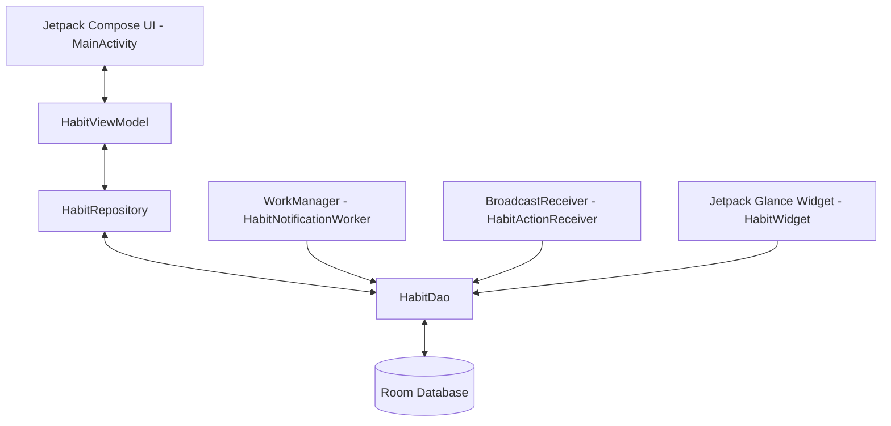

# 📈 Habit Tracker Android Application

[](https://developer.android.com)
[](https://kotlinlang.org/)
[](https://developer.android.com/jetpack/compose)
[](https://developer.android.com/training/data-storage/room)
[-orange?style=for-the-badge)](https://developer.android.com/jetpack/androidx/releases/glance)
[](LICENSE)

A modern, offline-first Android application designed to build habits, schedule tasks, and track long-term progress. Built using Android Jetpack libraries (Compose, Room, WorkManager, Glance) and architected under the MVVM (Model-View-ViewModel) pattern with clean architecture principles.

---

## 📖 Table of Contents
1. [Key Features](#-key-features)
2. [Application Architecture](#%EF%B8%8F-application-architecture)
3. [Technical Stack](#-technical-stack)
4. [Project Structure](#-project-structure)
5. [Getting Started & Local Execution](#-getting-started--local-execution)
6. [Output Artifacts & App Location](#-output-artifacts--app-location)
7. [Open Source Contribution Guidelines](#-open-source-contribution-guidelines)
8. [License](#-license)

---

## 🌟 Key Features

### 📅 Daily Habits Tracker
- **Visual Month-at-a-Glance Grid**: Tracks daily habits horizontally with distinct color-coded indicators representing week boundaries.
- **Streak Calculation**: Instantly computes and displays completion streaks (🔥) based on consecutive completes.
- **Interactive Checklists**: Log daily completions simply by tapping on the grid.
- **Statistics Dashboard**: Real-time progress bars and completion percentages computed per habit based on target completion counts.

### ⏰ Task Scheduler & Timetable
- **Day-by-Day Task Tracking**: Schedule specific tasks for any selected date using an interactive DatePicker.
- **Precision Time Scheduling**: Assign specific reminder times to tasks using an Android TimePickerDialog.
- **Local Alarms**: Schedules precise alerts using local notification receivers to alert you when tasks are due.

### 📊 Calendar Insights
- **Monthly Completion Grid**: Select any habit to view a clean 7-column monthly calendar view highlighting completed days in green.
- **Habit-specific Streaks**: Dedicated cards displaying current and maximum streaks for selected habits.

### 📱 Glance Home-Screen Widget
- **Compose-based Widget**: Implemented with **Jetpack Glance** for a modern widgets experience.
- **Dynamic Daily Progress**: Displays the summary of habits completed today vs total habits directly on the Home Screen.
- **Instant App Access**: Tap the widget to open the app.

### 🔔 Smart Background Reminders
- **WorkManager Integration**: Schedules robust daily checks to prompt users about pending habits.
- **Notification Action Buttons**: Mark habits as completed directly from the push notification using the inline "I did it!" action button, utilizing a background `BroadcastReceiver`.

---

## 🛠️ Application Architecture

The application adopts the **MVVM (Model-View-ViewModel)** architectural pattern. It is designed to be offline-first, relying on Room for all local data transactions, ensuring the app works perfectly without internet access.



### Core Architecture Components:
*   **Model Layer (`data/`)**: Defines the Schema for Database Entities (`Habit`, `HabitCompletion`, `Task`) and manages DB operations through standard DAOs (`HabitDao`) and Repository patterns (`HabitRepository`).
*   **ViewModel Layer (`ui/`)**: Encapsulates state management via Kotlin `StateFlow`. Exposes observables for UI consumption, handles UI actions, and performs asynchronous operations using Coroutine scopes.
*   **View Layer (`MainActivity.kt`)**: Declarative UI built purely using Jetpack Compose, responding dynamically to state changes emitted by the ViewModel.
*   **Widget Provider (`widget/`)**: Employs Jetpack Glance to build the RemoteViews layout using Compose syntax, pulling the latest daily completion metrics asynchronously.
*   **Background Services (`worker/`)**: Periodic workers (`WorkManager`) and Receivers (`BroadcastReceiver`) handle system-level events (alarms, boot complete, notifications, and notification quick actions).

---

## 💻 Technical Stack

-   **Programming Language**: Kotlin (JVM Target 17)
-   **Minimum SDK**: API 24 (Android 7.0)
-   **Compile & Target SDK**: API 34 (Android 14)
-   **Build Tool**: Gradle (Kotlin/Kapt plugins)
-   **UI Framework**: Pure Jetpack Compose with Material 3 components
-   **Database**: Room Persistence Library (v2.6.0)
-   **Concurrency**: Kotlin Coroutines & Flow (for reactive database streams)
-   **Background Processing**: Jetpack WorkManager (v2.8.1)
-   **App Widgets**: Jetpack Glance (v1.0.0)

---

## 📂 Project Structure

```text
├── app
│   ├── build.gradle               # App-level build configurations & dependencies
│   └── src
│       └── main
│           ├── AndroidManifest.xml # Core manifest file declaring permissions & activities
│           ├── java
│           │   └── com.example.habittracker
│           │       ├── HabitTrackerApp.kt    # Main application setup (WorkManager initialization)
│           │       ├── MainActivity.kt       # Jetpack Compose Screens & tab routing
│           │       ├── data
│           │       │   ├── Habit.kt          # Room Entities (Habit, HabitCompletion)
│           │       │   ├── HabitDao.kt       # Room Database DAOs & HabitDatabase abstraction
│           │       │   ├── HabitRepository.kt# Repository layer for domain decoupling
│           │       │   └── Task.kt           # Room Task Entity
│           │       ├── ui
│           │       │   └── HabitViewModel.kt # State management & business logic flow
│           │       ├── widget
│           │       │   └── HabitWidget.kt    # Glance Widget receiver & views
│           │       └── worker
│           │           ├── HabitActionReceiver.kt    # Action receiver for notifications
│           │           ├── HabitNotificationWorker.kt# WorkManager notification sender
│           │           └── TaskReminderReceiver.kt   # Scheduled task alarm receiver
│           └── res                           # Layout resources, colors, icons, values
├── build.gradle                   # Project-level gradle configurations
├── settings.gradle                # Module configuration declarations
├── gradle.properties              # JVM / Gradle configuration flags
├── gradlew                        # Unix gradlew executable
└── gradlew.bat                    # Windows gradlew executable
```

---

## 🚀 Getting Started & Local Execution

### Prerequisites
1.  **JDK**: Java Development Kit 17 installed.
2.  **Android Studio**: Android Studio Ladybug (or higher) recommended.
3.  **SDK**: Android SDK for API 34 installed.

### Setup and Running the Project

#### Step 1: Clone the Repository
```bash
git clone https://github.com/ArokiyaNithish/Arokiya-Nithish.git
cd Arokiya-Nithish
```

#### Step 2: Open in Android Studio
- Open Android Studio.
- Choose **File > Open** and select the project directory root.
- Wait for Gradle to download dependencies and sync the project.

#### Step 3: Run the Application
- Connect an Android device with USB debugging enabled, or launch an Emulator (API level 24+).
- Click the **Run** button (`Shift + F10`) in Android Studio to build and deploy.

#### Step 4: Build from Command Line (Optional)
To build the application manually using Gradle:
```bash
# On Windows PowerShell / Command Prompt:
.\gradlew assembleDebug

# On macOS / Linux:
./gradlew assembleDebug
```

---

## 📦 Output Artifacts & App Location

Once a successful build runs, Gradle outputs the compiled APK packages inside the build outputs directory.

*   **Debug Build APK**:
    `app/build/outputs/apk/debug/app-debug.apk`
    *Use this to install the app on testing devices or emulator environments without sign-offs.*
*   **Release Build APK (Unsigned)**:
    `app/build/outputs/apk/release/app-release-unsigned.apk`
    *Requires keystore signing prior to Google Play Store deployments.*

---

## 🤝 Professional Open Source Contribution Guide

We welcome contributions from developers worldwide! To maintain code quality, consistency, and professional open-source standards, we adhere to the following developer protocols:

### 1. Code of Conduct
We are committed to fostering an inclusive, welcoming, and harassment-free community. All contributors are expected to behave professionally, treat others with respect, and value diverse perspectives.

### 2. Git Workflow & Branching Model
We employ a structured Git branching strategy to keep the codebase stable and trackable:

- **Branch Naming Conventions**:
  - New features: `feature/short-description` (e.g., `feature/habit-archiving`)
  - Issue fixes: `bugfix/issue-id-description` (e.g., `bugfix/102-fix-calendar-grid`)
  - Refactoring: `refactor/clean-viewmodel` (e.g., `refactor/optimize-database-queries`)
  - Documentation: `docs/readme-updates`

- **Step-by-Step Workflow**:
  1. **Fork** the primary repository: `ArokiyaNithish/Arokiya-Nithish`.
  2. **Clone** your fork locally and configure the upstream remote:
     ```bash
     git remote add upstream https://github.com/ArokiyaNithish/Arokiya-Nithish.git
     ```
  3. **Create a branch** for your work:
     ```bash
     git checkout -b feature/your-feature-name
     ```
  4. **Sync with Upstream** regularly to avoid merge conflicts:
     ```bash
     git fetch upstream
     git rebase upstream/main
     ```
  5. **Push changes** to your fork:
     ```bash
     git push origin feature/your-feature-name
     ```
  6. Submit a **Pull Request (PR)** to the upstream `main` branch.

---

### 3. Coding Standards & Architectural Guidelines
To ensure clean maintainability, all codebase contributions must respect these engineering tenets:

*   **Architecture Pattern**: Maintain strict **MVVM + Clean Architecture** segregation. 
    *   Do *not* execute network or database queries inside UI composables. Route all triggers through the `HabitViewModel`.
    *   Use `StateFlow` and `collectAsStateWithLifecycle()` to pass state to Jetpack Compose elements safely.
*   **Kotlin Code Styling**: Follow the official [Kotlin Coding Conventions](https://kotlinlang.org/docs/coding-conventions.html).
    *   Keep lines under 120 characters where possible.
    *   Ensure variable names represent the context (e.g., use `habitCompletionDate` instead of `d`).
*   **Resource Allocation**: Store colors, dimensions, string constants, and themes cleanly within resource folders (`app/src/main/res/`). Do not hardcode style elements within Composable files.
*   **Test-Driven Execution**: Write JUnit tests under `app/src/test` for any functional additions in repositories, validation helpers, or streak logic.

---

### 4. Conventional Commits Standard
To maintain a clean, auto-generated changelog, we enforce [Conventional Commits v1.0.0](https://www.conventionalcommits.org/en/v1.0.0/):

| Commit Type | Description | Example |
| :--- | :--- | :--- |
| **`feat(...)`** | A new user-facing feature or enhancement | `feat(widget): add quick log completion toggle` |
| **`fix(...)`** | A bug fix in the application logic or UI | `fix(insights): correct streak calculation logic` |
| **`docs(...)`** | Documentation-only changes (like README modifications) | `docs(readme): add build command configurations` |
| **`style(...)`** | Code formatting, spacing, linting corrections | `style(ui): reformat spacing inside HabitRow` |
| **`refactor(...)`** | Code changes that neither fix bugs nor add features | `refactor(db): migrate query architecture to Flow` |
| **`test(...)`** | Adding or correcting unit or instrumentation tests | `test(viewmodel): write unit tests for streak calculator` |
| **`chore(...)`** | Project configurations, dependencies, build files | `chore(gradle): upgrade Room database dependency version` |

---

### 5. Pull Request (PR) Checklist
Before submitting a PR, make sure you can check off every item on this list:
- [ ] Code builds successfully locally without warnings (`.\gradlew assembleDebug`).
- [ ] No formatting issues or Kotlin compile-time errors exist.
- [ ] All unit and instrumentation tests pass.
- [ ] The change is accompanied by tests if it affects business logic.
- [ ] For visual UI adjustments, include high-quality screenshots/GIFs demonstrating before-and-after states.

---

## 📄 License

This project is open-source and licensed under the terms of the **[MIT License](LICENSE)**. You are free to modify, distribute, and integrate the code in personal or commercial projects.

---

## 👤 Developer & Maintainer Details

This project is actively maintained and designed under open-source standards by:

*   **Lead Developer**: **Arokiya Nithish**
*   **GitHub Profile**: [@ArokiyaNithish](https://github.com/ArokiyaNithish)
*   **Primary Workspace Repository**: [Arokiya-Nithish](https://github.com/ArokiyaNithish/Arokiya-Nithish)
*   **Developer Focus**: High-Performance Mobile Architectures, Jetpack Compose, Offline-First Applications, and Android Design Systems.

For questions, issues, or custom feature requests, feel free to open a ticket in the repository's **Issues** section. Contributions are reviewed daily!

